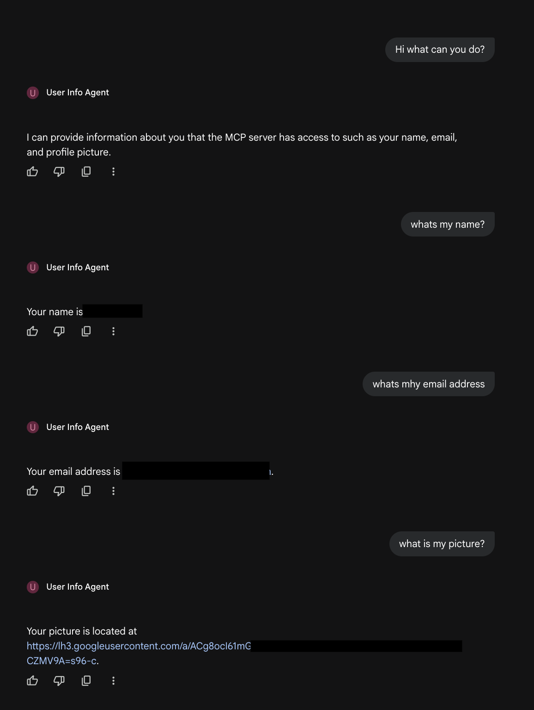

# Scenario 2: Deploy an ADK Agent w/ MCP Toolset in Gemini Enterprise using End User Authentication

This scenario guides you through setting up and testing an ADK agent that consumes a toolset from an MCP server using end user authentication. The guide covers two deployment options for the agent:

*   **Local:** Running the agent with `adk web`.
*   **Agent Engine:** Deploying the agent to Agent Engine and registering it with Gemini Enterprise with an `auth_id` used for end user authentication.

The MCP server is hosted on Cloud Run and provides a tool that returns information about an end user such as their name, email address and picture URL from their identity provider. In this case of this guide, you will Google Cloud Identity.

To access these tools, the ADK agent's service account must be granted the **Cloud Run Invoker** role.

## Prerequisites

You must create and update the `.env` file used by the applications in this scenario. An `.env.example` file is found for each in the `1_cloud_run` and `2_agents` folders. 

1. In the `scenario_2` folder:

```bash
cp 1_cloud_run/.env.example 1_cloud_run/.env
cp 2_agents/.env.example 2_agents/.env
```

2. Modify the `PROJECT_ID` and `REGION` values found in the `1_cloud_run` folder to your GCP project and region.

3. Modify the `GOOGLE_CLOUD_PROJECT`, `GOOGLE_CLOUD_PROJECT_NUMBER`, `GOOGLE_CLOUD_LOCATION` and `GEMINI_ENTERPRISE_APP_ID` to the values corresponding to your GCP project. You can find the project number by running the `gcloud` command below:

```bash
gcloud projects list --filter="PROJECT_ID:$GOOGLE_CLOUD_PROJECT" --format="value(PROJECT_NUMBER)"
```

## 1. OAuth Consent Configuration

This setup involves configuring the OAuth consent screen and credentials in your Google Cloud Project and then registering those credentials as an Authorization Resource for use in agentic workflows (e.g.,Genini Enterprise). If you’ve already set up OAuth consent in your project you will not need to perform this step.

### Step 1: Configure the OAuth Consent Screen
In the Google Cloud Console:

1. Navigate to **APIs & Services > OAuth consent screen**. Click **Get Started**.
2. Give the application a name and select your GCP project’s user as the User support email address:
    - **App name:** `Gemini Enterprise`
    - **User support email:** (Use your gcp project user’s email address)

Click **Next**.

3. Under Audience select the **Internal** radio option. Click **Next**.
4. Use your gcp project user’s email address for Contact Information. Click **Next**.
5. Select the “I agree” checkbox. Then click **Continue**.

Click **Create** once the steps above are completed. 

- ✅ You should see a notification that an OAuth configuration has been created.

### Step 2: Create OAuth 2.0 Client Credentials
In this step, you register an OAuth client now that you’ve configured OAuth consent in your GCP project. 

1. Navigate to **APIs & Services > Credentials**.
2. Click **+ Create Credentials > OAuth client ID**.
    - For **Application type**, select **Web application**.
    - Enter a **Name** for your OAuth client ID. 
        - For example, `Gemini Enterprise ADK Client`

3. Under **Authorized redirect URIs**, click **Add URI**. For ADK and Vertex AI Search agents, you typically must include the following URIs:
    - `https://vertexaisearch.cloud.google.com/oauth-redirect` (redirect URI for GE)
    - `https://vertexaisearch.cloud.google.com/static/oauth/oauth.html` (same as above)
    - `http://127.0.0.1/dev-ui/` (redirect URI for ADK web)

Click **Create**. 

- ⚠️ You should see a dialog showing you your newly created **Client ID** and **Client secret**. 
- 🚨 Copy these values immediately and store them in the `.env` file located in the `2_agents/` directory. You’ll need to reference these values in a later step.

Now that you’ve created an OAuth consent configuration and application credentials, you can run the steps found in the git repository’s README file to deploy the MCP server and test the agents.

## 2. Deploy the MCP Server to Cloud Run

To deploy the MCP server:

1. Navigate to the `1_cloud_run/` directory:

```bash
cd 1_cloud_run/
```

2. Make the `deploy.sh` script runnable in your terminal:

```bash
chmod +x deploy.sh
```

3. Run the `deploy.sh` script:

```bash
./deploy.sh
```

Similar to Scenario 1 in this repo, the ``deploy.sh`` script automates the deployment of a containerized application to Google Cloud Run. When you run this script, it performs the following actions:

1.  **⚙️ Configuration and Validation:**
    *   It loads any environment variables you have set in a `.env` file.
    *   It checks if you have the `gcloud` command-line tool installed.
    *   It determines your Google Cloud Project ID and a default region (`us-central1`), though you can override these with environment variables.

2.  **☁️ Enables Google Cloud Services:**
    *   It silently enables the necessary Google Cloud services for you, including Cloud Run for hosting, Artifact Registry for storing container images, and Cloud Build for running the deployment pipeline.

3.  **🔐 Permissions Management:**
    *   The script automatically grants the necessary IAM permissions to the Cloud Build service account. This allows it to deploy the application to Cloud Run on your behalf, so you don't have to manually configure these permissions.

4.  **📦 Container Repository Setup:**
    *   It ensures that a container repository exists in Artifact Registry. If it doesn't, the script creates it for you. This repository is where the container image for your application will be stored.

5.  **🚀 Application Build and Deployment:**
    *   The script initiates a Cloud Build process, which reads the ``cloudbuild.yaml`` file to build your application's container image, push it to the Artifact Registry repository, and then deploy it to Cloud Run.

6.  **🎉 Provides Service URL:**
    *   Once the deployment is complete, the script fetches the URL of your newly deployed service and prints it to the console. 

<div style="border-left: 6px solid #acacb0; background-color: #5a5a5a; padding: 15px; margin: 20px 0;">
  <p>⚠️ <strong>Important:</strong> Copy the service URL from the previous step and paste it into the <code>.env</code> file located in the <code>2_agents/</code> directory. Set it as the value for the <code>MCP_SERVER_URL</code> variable.</p>
  <p><strong>🚨 Important:</strong> Ensure the URL ends with <code>/mcp</code>.</p>
</div>

## 2. Run the ADK agent locally

To run the ADK agent locally using `adk web` run do the following:

1. Navigate to the `2_adk_agents` directory:

2. Run the following command:

```bash
uv sync
```

Then run:

```bash
uv run adk web
```

This will run the [ADK web](https://google.github.io/adk-docs/runtime/web-interface/) interface in your local terminal so that you can test the agent via a chat interface.

```diff
+ +-----------------------------------------------------------------------------+
+ | ADK Web Server started                                                      |
+ |                                                                             |
+ | For local testing, access at http://127.0.0.1:8000.                         |
+ +-----------------------------------------------------------------------------+
```

3. Open the link returned when running `adk web` in your browser. Change the dropdown to the `local/` folder to test your agent.

#### Test the agent locally

4. Sample agent interaction below:


> User: Hi! What can you do?

> Agent: Hi there! I can provide information about you that the MCP server has access to, such as your name, email, and profile picture. How can I help you today?

> User: whats my email address?

> Agent: Your email address is zzzzzz@yyyyy.com.

> User: whats my name?

> Agent: Your name is ****** ********.

## 3. Deploy the ADK agent to Agent Engine

Now that you've tested the ADK agent locally, it can be deployed to Agent Engine.

Run the following command from the `2_adk_agents` directory to deploy the agent:

```bash
uv run adk deploy agent_engine --display_name "User Info Agent" --description "ADK agent that returns user information from an MCP server hosted on Cloud Run" --env_file .env ./agent_engine/
```

Once the agent is deployed you will see output in the terminal similar to the following:

```diff
✅ Created agent engine: projects/project-number/locations/us-central1/reasoningEngines/agent-engine-id
```

Copy the agent engine resource ID to your `.env` file in the `2_agents/` folder under the key `AGENT_ENGINE_ID`.

## 4. Create an Authorization Resource for End User Authentication in Gemini Enterprise

In order for the Gemini Enterprise frontend web application to authenticate an end user when an agent is invoked, you must create an [authorization resource](https://docs.cloud.google.com/gemini/enterprise/docs/register-and-manage-an-adk-agent#add-authorization-resource). You can do so using the Cloud Console UI or [API](https://docs.cloud.google.com/gemini/enterprise/docs/register-and-manage-an-adk-agent#add-authorization-resource).

From the `scenario_2/` folder, run the `create_auth_id.py` script to register the authorization resource to Gemini Enterprise:

```bash
uv run agent_engine/create_auth_id.py
```

When the script finishes, you should see output similar to the following:

```text
✅ Successfully registered AUTH_ID to Gemini Enterprise!
💬 Response: ......
```

## 5. Register the ADK agent with Gemini Enterprise

To register the ADK agent with Gemini Enterprise, you can use the Cloud Console UI or [API](https://docs.cloud.google.com/gemini/enterprise/docs/register-and-manage-an-adk-agent#register_adk_agent-drest).

From the `scenario_2/` folder, run the `register_to_ge.py` script to register the agent to Gemini Enterprise:

```bash
uv run agent_engine/register_to_ge.py
```

When the script finishes, you should see output similar to the following:

```text
✅ Successfully registered agent to Gemini Enterprise!
💬 Response: ......
```

Now that the agent has been registered to Gemini Enterprise with the associated Authorization Resource, you are ready to test the agent in the app.

3. Open the Gemini Enterprise application you registered the agent to in your web browser.

4. From the main chat interface, navigate to **Agents** > **Code Snippet Agent**

5. Run the same sample queries provided for testing locally. The output will look similar to the below image:


